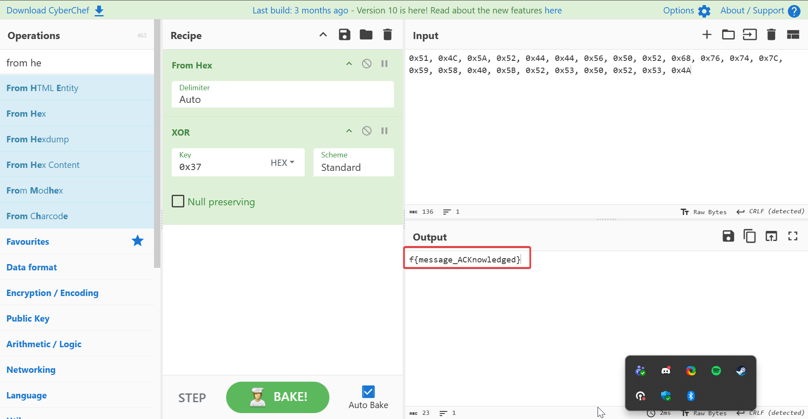

# ACKnowledge Me
**CTF:** MST Miner 2025
**Challenge Description:**

```md
# ACKnowledged

Joe Miner recieved an email titled "Please ACKnowledge" containing only one python file. He's confident there is something hidden here, but he just can't find it. 


## Additional Information
- The flag is of the format f{flag_here}
- This challenge will require additional programs beside just python
```

## Ignoring Instructions

While the description and the python file provided both indicate that you should use wireshark to solve this, I blatently ignored this and simply decoded the embedded hex values in the same way the script does to obtain the flag, taking the easy way.



## Alternative Solves

Alternatively there was the option to just copy paste the code and print out flag_plain/

Or you could have done it the indended way, finding the encoded value in Wireshark. You would then have to base64 decode, convert it from hex, and then xor it with the key `0x37`.