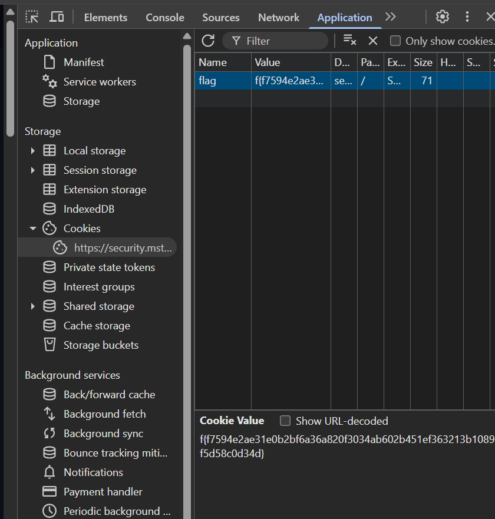
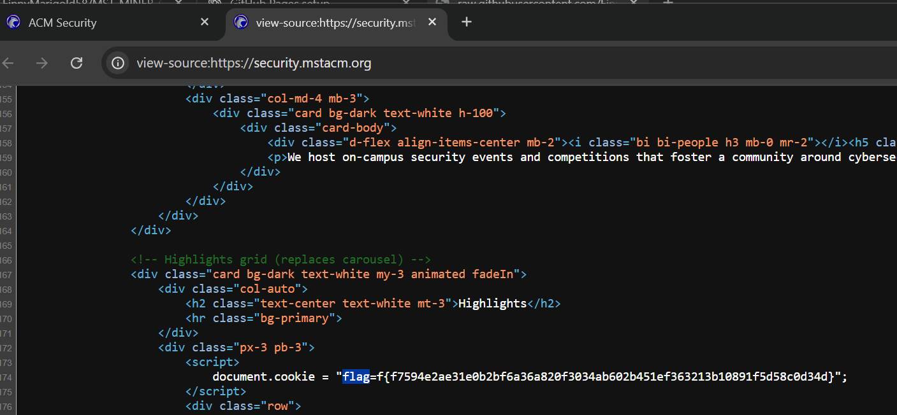

# Cookie Jar
**CTF:** MST Miner 2025
**Challenge Description:**

```md
I just love cookies. Chocolate chip, snickerdoodle, and monster... they're all great. But I think I dropped the last one I ate...

The last place I remember having it was https://security.mstacm.org/
```

Going to the website everything seems normal

## Intended Solve

Opening developer tools by right clicking then pressing "Inspect". To find your cookies click the >> and go to the Application tab. There is a section for website cookies where you can find the flag value.



## Unintended Solve

Another way to solve this challenge is to simply open the website's source code and Ctrl+F for flag. When you do this the flag will appear.



Flag: `f{f7594e2ae31e0b2bf6a36a820f3034ab602b451ef363213b10891f5d58c0d34d}`