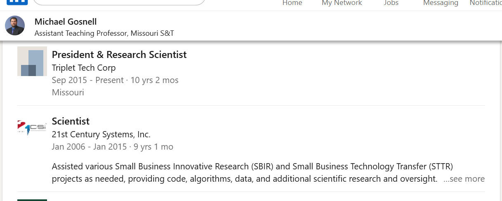
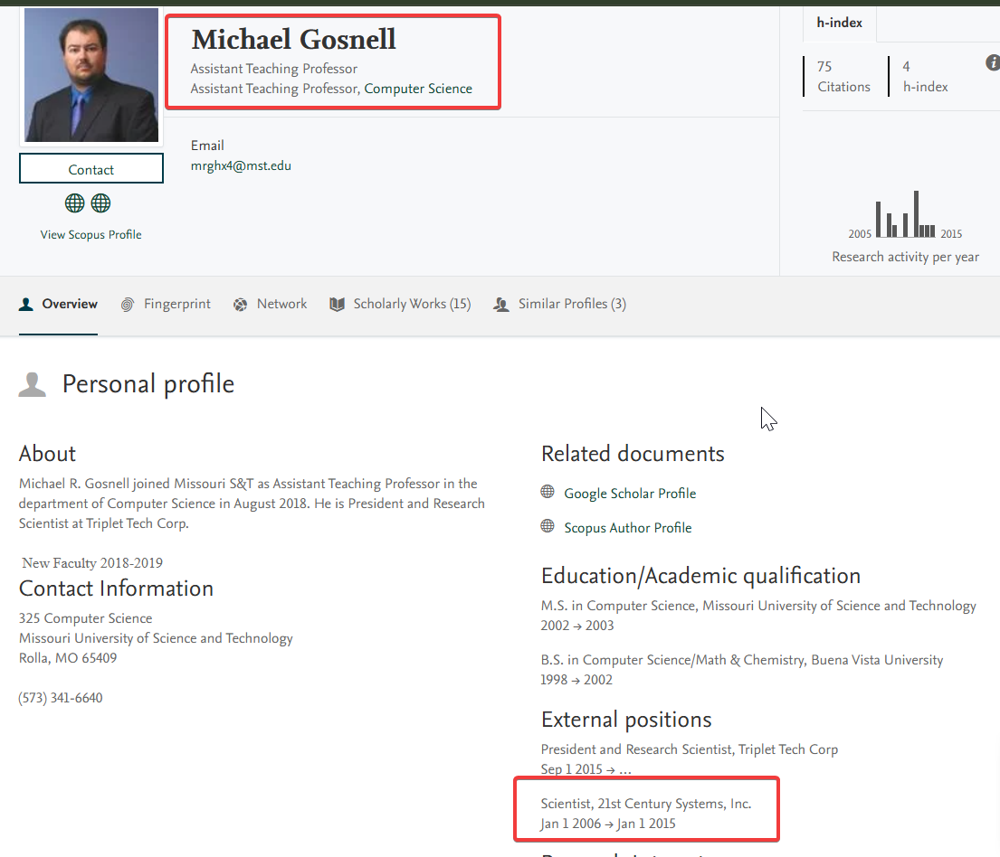

# Guess Who
**CTF:** MST Miner 2025
**Challenge Description:**

```md
Flag Format: f{firstname_lastname}

The task is to use your OSINT abilities to find the Missouri S&T faculty member we have been looking for. All we know of them are these facts

* They are located in the Computer Science Building
* They were a cameraman for S&T events in the past
* Had a role as Scientist at one point (As in the role was just called Scientist)
```

## Initial Steps

The first steps I took were to simply go to the [faculty list](https://cs.mst.edu/people/faculty-directory/) for professors in the Comp Sci building. Form here I manually searched for all the professors LinkedIn. Upon reaching Michael Gosnell's [LinkedIn](https://www.linkedin.com/in/michael-gosnell-aba20210), I seen that he indeed served a position as "Scientist"


This makes the flag: `f{Michael_Gosnell}`!


## Additional Notices

While writing this writeup, I noticed that this also shows in this external positions on his mst elsevierpure

