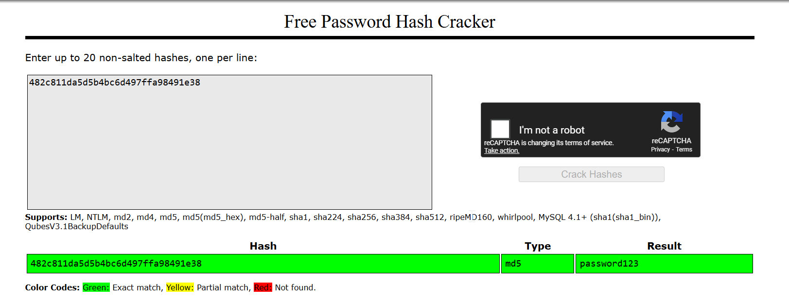

# Locked Out
**CTF:** MST Miner 2025
**Challenge Description:**

```md
Flag Format: flag{flag_format}

After participating the workshop hosted by SecOffs team,Joe Miner has intercepted the
following login payload during a pentest on the legacy academic website start with the
ominous letter “C”:

user: jminer\npass_digest: 482c811da5d5b4bc6d497ffa98491e38

He also retrieved some comments, providing additional insight on the spaghetti code
that hurt his eyes the longer he looked at it.The source code read:
// Nested conditionals, 16 then 32 with wrapping

Can you figure out what password leads to the hash?
```

## Challenge Observations
In a hurry to solve this challenge, I threw the hash into an online hash cracker, [Crackstation](https://crackstation.net/). The website returned the password!


Using this password we can make the flag: `flag{password123}`!

## Additional Solve Paths
This challenge looks similar to [Don't Anger It](../DontAngerIT/writeup.md) with the only difference being their is no zip file this time. Throwing this into hashcat again, we once again receive the unhashed password.

```bash
┌──(kali㉿kali)-[~/Desktop]
└─$ hashcat -m 0 "482c811da5d5b4bc6d497ffa98491e38" /usr/share/wordlists/rockyou.txt
hashcat (v6.2.6) starting

482c811da5d5b4bc6d497ffa98491e38:password123
```