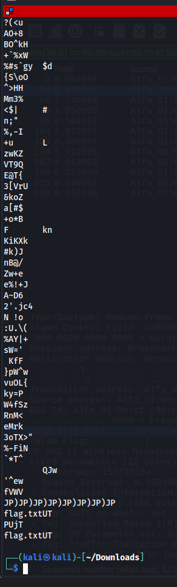
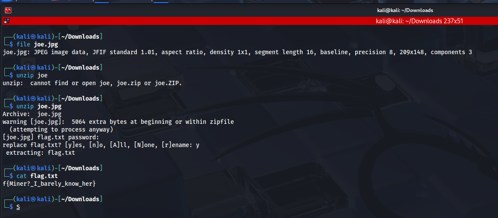

# New Joe Who Dis?
**CTF:** MST Miner 2025
**Challenge Description:**

```md
In an attempt to raise campus moral, Mo Dehghani has been working diligently with the marketing team to create a new motto for campus. To maintain the secrecy, Mo has decided to distribute the new motto as covertly as possible. He entrusted the coded message to us, but we have had trouble figuring out where it is. His only hint was "think of what Joe Miner wields" and we still cannot figure it out. We ask that you help us find the code within the image sent to us!
```

## Initial Observations

It was appearant that joe.jpg was hiding some kind of other file inside. After running exiftools, steghide, and many other tools the only useful output was from strings. 

joes.jpg Strings:



## Zip Discovery

From the strings output I could tell that somehow I would need to extract the flag.txt file. After a bit of googling, and some help from ChatGPT. I found that the hex of the file contained the header of a ZIP file. 

Running the command `unzip joe.jpg`, I was prompted to the password. This is where the hint came into play: "think of what Joe Miner wields". Joe Miner wields a `pickaxe`! The password for the zip is pickaxe where the flag.txt becomes visible leaving you with the flag!

