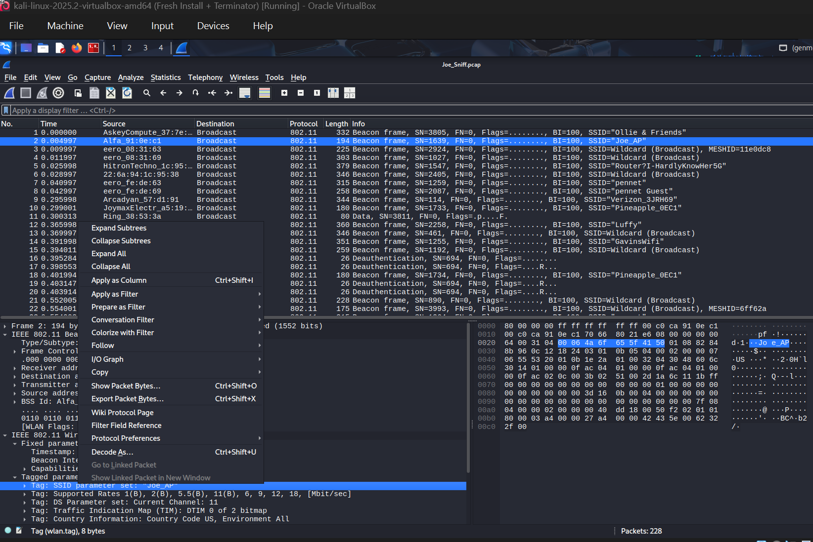
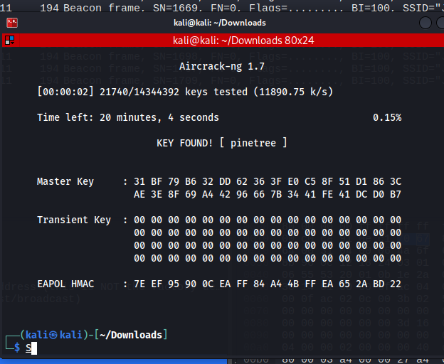

# A "Stick"-y Situation (Networking)
**CTF:** MST Miner 2025
**Challenge Description:**

```md
So this isn't good. Joe Miner recently locked himself out of his closet that had is WiFi router. And his phone. And his keys to the closet.
Joe ALSO has a meeting soon with guests that need his WiFi, but he isn't connected either and forgot the password!
However, Joe does still have his laptop and a smart sprinkler he can connect to his WiFi. So far he has captured traffic of the sprinkler connecting to his router, but that's it.

All he remembers about his password is that the first four letters are "pine", and it's eight lowercase letters long in total.
```

## Wireshark

Since we are given a .pcap (packet capture), the first thing I did was load up my VM and opened Wireshark. Wireshark is a application that can analyze and follow packet traffic, including pcap files. In Wireshark I applied a filter to only show Joe_AP. 


From this, I realized we can simply run aircrack-ng on this .pcap using the rockyou.txt, which contains the top cracked passwords.



Aircrack has found the password and flag! `pinetree`