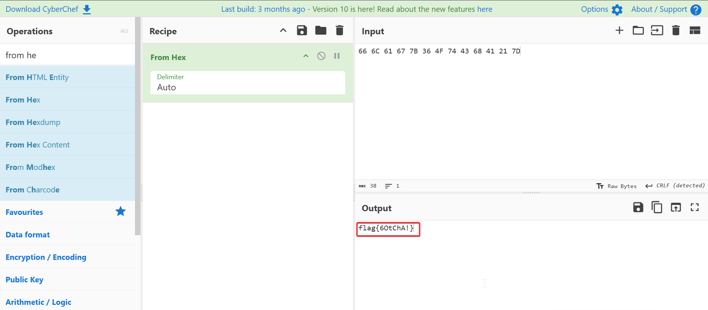

# The Jigg Is Up
**CTF:** MST Miner 2025
**Challenge Description:**

```md
Joe Miner has recently begun playing a clicker game reached out to his friend to get a mouse jiggler to keep the game awake. About a week later he noticed strange devices were connecting to his WiFi. Check the mouse jiggler to see if you can find why this is happening.

PLEASE DO NOT RUN THE SCRIPT (This is not a hint, the script is not supposed to be ran. If you are curious, do it in an isolated vm)
Flag Format: flag{} 
```

## Script Overview

The provided script is a fun one for sure. The attack path is something like this:

1. Get plain text password for Joes_Wifi
2. Posts password to a fake url (actually the flag)
3. Infinite Loop
    1. Alt+Tabs 1-5 times
    2. Wiggles the mouse 4-9 times to a random position
    
## Flag

As I was decoding the hex sequences, I found the flag as the post url.


Flag: `flag{6OtChA!}`
